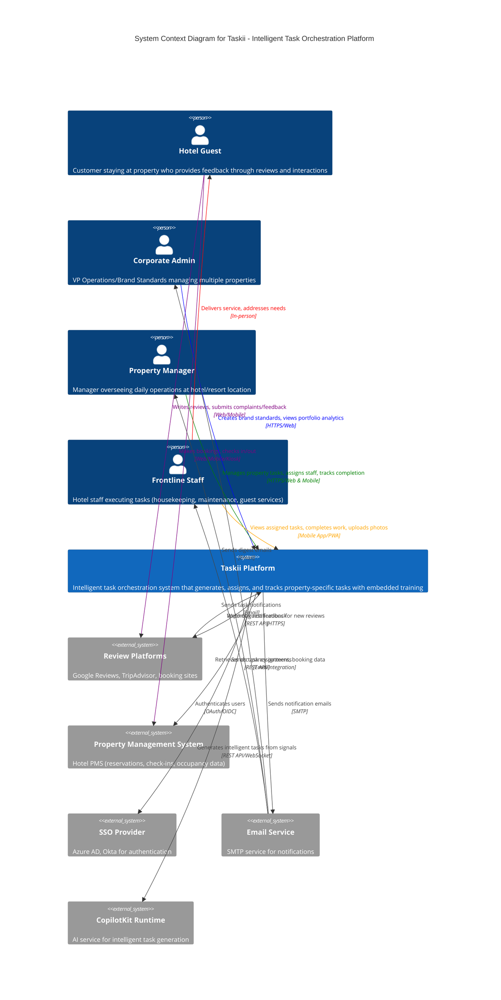

# Taskii Architecture Overview

---
type: Architecture
c4_level: System
created: 2025-10-20
last_updated: 2025-10-20
status: active
---

## Title

Taskii - Intelligent Task Orchestration Platform for Hospitality

## Description

Taskii is an intelligent task orchestration platform that automatically translates brand standards, guest feedback, and operational signals into property-specific tasks for hotel and travel brands. The system marries the operational requirements outlined in the project brief with enterprise standards for scalable, AI-enhanced task management.

## Architectural Principles

### 1. Intelligent Task Generation
- **Decision**: Implement AI-driven task creation using CopilotKit runtime integration
- **Rationale**: Aligns with project brief's requirement for automatic task generation from guest feedback, occupancy patterns, and brand standards
- **Standards Alignment**: Follows CopilotKit integration patterns from enterprise standards

### 2. Real-Time Multi-Property Updates
- **Decision**: Use Server-Sent Events (SSE) for real-time synchronization across properties and user sessions
- **Rationale**: Supports portfolio-level dashboards and immediate task updates as required in the brief
- **Standards Alignment**: Extends SSE implementation from enterprise standards to handle multi-tenant property data

### 3. Type-Safe Data Layer
- **Decision**: Prisma ORM with PostgreSQL for production scalability
- **Rationale**: Project requires complex relationships (properties, tasks, users, feedback) beyond simple todo items
- **Standards Alignment**: Builds upon Prisma database layer standards, upgrading from SQLite to PostgreSQL

### 4. Role-Based Access Control
- **Decision**: Implement hierarchical permissions (Corporate Admin → Property Manager → Frontline Staff)
- **Rationale**: Essential for multi-property management and data security as outlined in brief
- **Standards Alignment**: Extends basic authentication patterns to support SSO and role hierarchies

### 5. Personalized User Experience
- **Decision**: Build user preference system with multi-channel notification engine
- **Rationale**: Support diverse user needs across time zones, roles, and communication preferences
- **Implementation**: Local PostgreSQL storage with SSE-based synchronization across devices

### 6. Basic Analytics & Intelligence
- **Decision**: Compute analytics on-demand from operational database
- **Rationale**: MVP approach - simple metrics without complex data warehouse infrastructure
- **Implementation**: Server-side aggregation of task completion metrics and workload visibility

## MVP Scope & Implementation Approach

### POC Simplifications
This is a proof-of-concept MVP with the following simplified implementations:

**Analytics & Reporting**
- On-demand computation from PostgreSQL (no separate analytics DB)
- Simple dashboard metrics: task completion rates, staff workload, property performance
- Server-side aggregation with JSON API responses

**Notification System**
- Browser Push Notifications API (no external push services like Firebase)
- Email via SMTP (no SMS in MVP)
- In-app notification center with SSE for real-time updates
- All notification preferences stored in local PostgreSQL

**User Preferences**
- Simple preference storage in PostgreSQL
- Real-time sync across devices via SSE
- No complex preset templates (individual user customization only)

**Infrastructure**
- Single PostgreSQL database for all data
- No separate data warehouse or time-series database
- Local development with SQLite

## C4 System Context Diagram

### Diagram Key

**Internal System**
- **Taskii Platform**: Core intelligent task orchestration system

**External Personas**
- **Hotel Guest**: End customer whose feedback drives task generation and whose experience is improved through better service
- **Corporate Admin**: Sets brand standards, monitors portfolio performance
- **Property Manager**: Day-to-day task management for their location(s)
- **Frontline Staff**: Task execution, training consumption, completion verification

**External Systems**
- **Review Platforms**: Source of guest feedback that triggers service recovery tasks
- **Property Management System**: Source of operational data (occupancy, bookings)
- **SSO Provider**: Enterprise authentication and user management
- **Email Service**: Multi-channel notification delivery
- **CopilotKit Runtime**: AI-powered task generation engine

**Key Interactions**
- **Guest Feedback Loop** (purple): Guests provide reviews/complaints → triggers tasks → staff delivers better service
- Real-time task updates via SSE to all active user sessions
- Automated task generation from guest feedback and operational signals
- Multi-channel notifications (in-app, email, browser push)
- Role-based access control across organizational hierarchy
- Direct service delivery from staff to guests completes the feedback cycle