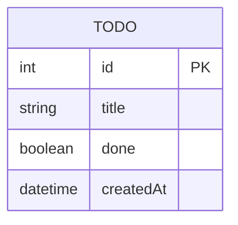

# Prisma Database Layer

---
type: Architecture
c4_level: Component
created: 2025-10-16
last_updated: 2025-10-16
status: active
---

## Title

Prisma Database Layer

## Description

The Prisma ORM provides type-safe database access and schema management for the Task Management Application. It uses SQLite for local development and rapid prototyping, with a simple schema focused on todo item management. The layer includes database migrations, seeding, and type-safe query operations through the Prisma Client.

## Tech Stack

- **ORM:** Prisma v6.17.1
- **Database:** SQLite (file-based, stored in `prisma/.data/dev.db`)
- **Schema Language:** Prisma Schema Language
- **Client:** TypeScript-generated Prisma Client
- **Migration Tool:** Prisma Migrate
- **Seeding:** TypeScript seed scripts

## Data Model

### Todo Entity
- **id:** Auto-incrementing integer primary key
- **title:** String (required)
- **done:** Boolean (default: false)
- **createdAt:** DateTime (default: now())

## Integrations

- [Task Management Application](./01-task-management-application.md) (main application)
- [Next.js API Routes](./01-task-management-application.md) (data access layer)

## Dependencies

- Prisma CLI v6.17.1+
- @prisma/client v6.17.1+
- Node.js v18+
- SQLite3

## Operations

### CRUD Operations
- **Create:** `prisma.todo.create()` - Add new todo items
- **Read:** `prisma.todo.findMany()` - Retrieve todos with ordering
- **Update:** `prisma.todo.update()` - Toggle completion status
- **Delete:** `prisma.todo.delete()` - Remove completed todos

### Database Management
- **Migrations:** `prisma migrate dev` - Apply schema changes
- **Seeding:** `prisma db seed` - Populate initial data
- **Reset:** `prisma migrate reset` - Reset database to clean state

## Configuration

### Schema Configuration
```prisma
generator client {
  provider = "prisma-client-js"
}

datasource db {
  provider = "sqlite"
  url      = "file:./.data/dev.db"
}
```

### Environment Setup
- Database file location: `prisma/.data/dev.db`
- Automatic schema generation via `prisma generate`
- Type-safe client available as `import { PrismaClient } from '@prisma/client'`

## Development Workflow

**Note:** Running `npm run dev` automatically handles database setup through the `predev` script, which executes `prisma migrate deploy && prisma generate && prisma db seed`.

1. **Schema Changes:** Modify `prisma/schema.prisma`
2. **Generate Client:** Run `prisma generate` to update types
3. **Create Migration:** Run `prisma migrate dev` for schema changes
4. **Seed Data:** Run `prisma db seed` to populate initial todos

## Performance Considerations

- SQLite suitable for development and small-scale prototyping
- File-based database enables easy backup and sharing
- No connection pooling required for single-user application
- Type-safe queries prevent runtime SQL injection vulnerabilities

## Related Items

- [01-task-management-application.md](./01-task-management-application.md)
- [00-developer-workflow.md](./00-developer-workflow.md)
- [01-user-requirements.md](./01-user-requirements.md)

## Diagrams

### Database Schema ERD

